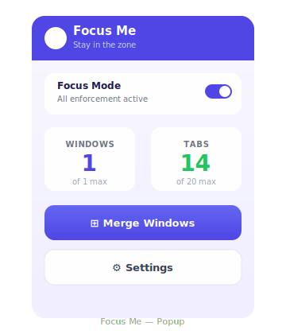
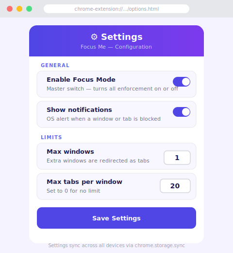
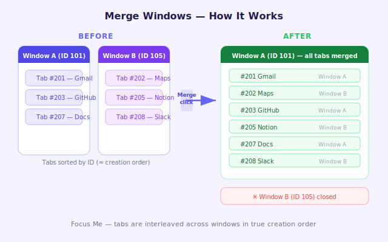

# Focus Me

A Chrome extension that helps you stay focused by limiting the number of browser windows and tabs you can have open at once.

<p align="center">
  
  &nbsp;&nbsp;&nbsp;&nbsp;
  
</p>

## Features

- **Window limit** — opening a new Chrome window above the configured limit automatically redirects its tabs into your existing window instead, and switches to the new tab so you never lose where you were going
- **Tab limit** — opening a tab beyond the per-window limit closes it immediately and shows a notification
- **Merge windows** — one-click button in the popup consolidates all open windows into one, ordering every tab by the time it was originally opened
- **Merge-aware tab limiting** — tabs accumulated from a merge are grandfathered in; only genuinely new tabs beyond that count are blocked
- **Configurable limits** — max windows (default 1) and max tabs per window (default 20, set to 0 for unlimited) are adjustable at any time from the Settings page
- **Notifications** — optional OS-level alerts explain why a window or tab was blocked (can be disabled)
- **Focus Mode toggle** — master switch that enables or disables all enforcement in one click

## Installation

The extension is not published to the Chrome Web Store. Load it as an unpacked extension:

1. **Generate icons** (one-time setup)
   - Open `generate_icons.html` in Chrome
   - Right-click each canvas → **Save image as** → save to the `icons/` folder as `icon16.png`, `icon48.png`, and `icon128.png`

2. **Load the extension**
   - Open Chrome and navigate to `chrome://extensions/`
   - Enable **Developer mode** (toggle in the top-right corner)
   - Click **Load unpacked** and select this repository folder

3. The Focus Me icon will appear in your toolbar. Pin it for quick access.

## Usage

### Popup

Click the Focus Me icon in the toolbar to open the popup.

| Element | Description |
|---|---|
| **Focus Mode** toggle | Master switch — turns all enforcement on or off |
| **Windows** stat | Current open window count vs. your configured limit |
| **Tabs** stat | Tab count in the current window vs. your limit. Turns red when at the limit |
| **Merge Windows** button | Moves all tabs from every open window into one, sorted by creation time |
| **Settings** button | Opens the full Settings page |

### Settings page

Right-click the extension icon → **Options**, or click **Settings** in the popup.

| Setting | Default | Description |
|---|---|---|
| Enable Focus Mode | On | Master toggle for all enforcement |
| Show notifications | On | OS alert when a window or tab is blocked |
| Max windows | 1 | Maximum number of normal Chrome windows. Extra windows are converted to tabs |
| Max tabs per window | 20 | Maximum tabs per window. Set to 0 for no limit |

Settings are saved to `chrome.storage.sync` and sync across your Chrome profile on all devices.

## How it works

<p align="center">
  
</p>


### Window enforcement

When a new normal (non-incognito, non-popup) window is created and the total window count exceeds `maxWindows`:

1. The extension waits briefly (150 ms) for the new window's tabs to finish initialising
2. It identifies the oldest existing window (lowest window ID) as the target
3. Every tab from the new window is moved to the target window (appended at the end)
4. The now-empty new window is closed
5. The target window is focused and the tab that was active in the blocked window is activated

### Tab enforcement

When a new tab is created and the window's tab count exceeds `effectiveLimit` (see merge baseline below):

1. The new tab is immediately closed
2. A notification is shown (if enabled) and a `!` badge flashes on the extension icon

### Merge Windows

When the user clicks **Merge Windows** in the popup:

1. All normal, non-incognito windows are sorted by window ID (oldest first)
2. Every tab across all windows is collected and sorted by tab ID (ascending = creation order)
3. Tabs are moved into the oldest window at their sorted positions
4. All other windows are closed
5. A **merge baseline** is stored: the resulting tab count in the merged window

### Merge baseline

After a merge the single window may hold more tabs than `maxTabs`. Without special handling, every subsequent `Ctrl+T` would be blocked. The merge baseline prevents this:

- `effectiveLimit = max(maxTabs, mergeBaseline)`
- New tabs are only blocked if `tabs.length > effectiveLimit`
- The baseline is cleared automatically once the user closes tabs back below `maxTabs`

## Project structure

```
focus-me/
├── manifest.json          # Extension manifest (Manifest V3)
├── background.js          # Service worker — all enforcement logic
├── popup.html             # Toolbar popup UI
├── popup.js               # Popup logic (stats, toggle, merge button)
├── options.html           # Settings page UI
├── options.js             # Settings page logic
├── styles.css             # Shared styles for popup and settings page
├── generate_icons.html    # Helper page to generate PNG icons
├── icons/                 # Extension icons (16 × 16, 48 × 48, 128 × 128)
├── tests/
│   └── background.test.js # Jest unit tests for background.js
├── package.json           # Dev dependencies (Jest)
└── .gitignore
```

## Development

### Prerequisites

- Node.js 18+
- npm

### Running tests

```bash
npm install
npm test
```

The test suite covers 24 cases across four areas:

| Area | Cases |
|---|---|
| Window limit enforcement | 8 |
| Tab limit enforcement | 6 |
| Merge baseline logic | 3 |
| `mergeAllWindows` function | 7 |

Tests use Jest with a hand-written Chrome API mock (`global.chrome`). The service worker (`background.js`) is loaded fresh for each test via `jest.resetModules()`, giving each test an isolated module state (including the `mergeBaselines` Map).

The internal 150 ms `setTimeout` inside the window-created handler is handled with `jest.runAllTimersAsync()`, which flushes microtasks between timer runs and correctly fires timers created inside async code.

### Reloading after changes

After editing any source file, go to `chrome://extensions/` and click the reload button on the Focus Me card.

## Permissions

| Permission | Reason |
|---|---|
| `windows` | Detect new windows, query open windows, move/close/focus windows |
| `tabs` | Query, move, close, and activate tabs |
| `storage` | Persist settings via `chrome.storage.sync` |
| `notifications` | Show OS alerts when windows or tabs are blocked |

The extension requests no host permissions and injects no scripts into web pages.

## Known limitations

- Incognito windows are never counted or affected
- Popup-type windows (OAuth flows, extension UIs) are never counted or affected
- The window and tab limits apply per Chrome profile; a second profile has its own independent count

## Contributing

1. Fork the repository
2. Create a feature branch (`git checkout -b feature/my-change`)
3. Make your changes and add tests where appropriate
4. Run `npm test` to confirm all tests pass
5. Open a pull request

## License

MIT
